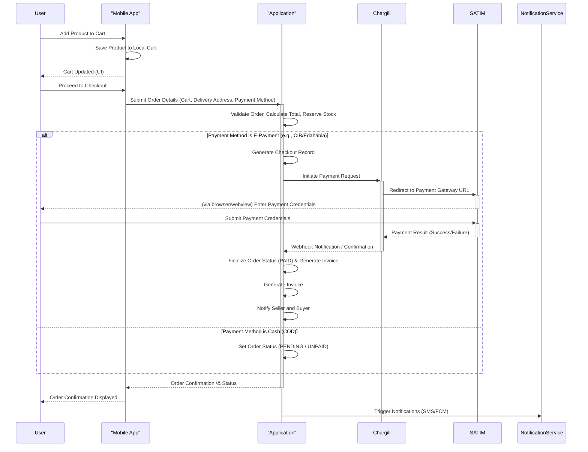

```mermaid
sequenceDiagram
    participant User
    participant MobileApp as "Mobile App"
    participant Backend as "Application"
    participant Chargili
    participant SATIM

    User->>MobileApp: Add Product to Cart
    MobileApp->>MobileApp: Save Product to Local Cart
    MobileApp-->>User: Cart Updated (UI)

    User->>MobileApp: Proceed to Checkout
    MobileApp->>+Backend: Submit Order Details (Cart, Delivery Address, Payment Method)
    Backend->>Backend: Validate Order, Calculate Total, Reserve Stock

    alt Payment Method is E-Payment (e.g., CIB/Edahabia)

        Backend->>Backend: Generate Checkout Record
        Backend->>+Chargili: Initiate Payment Request
        Chargili->>+SATIM: Redirect to Payment Gateway URL
        SATIM-->>-User: (via browser/webview) Enter Payment Credentials
        User->>+SATIM: Submit Payment Credentials

        SATIM-->>-Chargili: Payment Result (Success/Failure)
        Chargili-->>-Backend: Webhook Notification / Confirmation
        Backend->>Backend: Finalize Order Status (PAID) & Generate Invoice
Backend->>Backend: Generate Invoice 
        Backend->>Backend: Notify Seller and Buyer
    else Payment Method is Cash (COD)

        Backend->>Backend: Set Order Status (PENDING / UNPAID)
        

    end

    Backend-->>-MobileApp: Order Confirmation \& Status 
    MobileApp-->>User: Order Confirmation Displayed 
    
    Backend->>NotificationService: Trigger Notifications (SMS/FCM)
```
