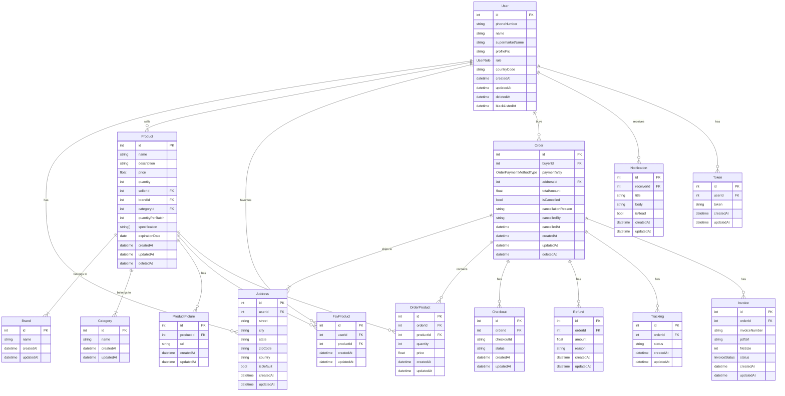

```mermaid
erDiagram
    User {
        int id PK
        string phoneNumber
        string name
        string supermarketName
        string profilePic
        UserRole role
        string countryCode
        datetime createdAt
        datetime updatedAt
        datetime deletedAt
        datetime blackListedAt
    }

    Address {
        int id PK
        int userId FK
        string street
        string city
        string state
        string zipCode
        string country
        bool isDefault
        datetime createdAt
        datetime updatedAt
    }

    Product {
        int id PK
        string name
        string description
        float price
        int quantity
        int sellerId FK
        int brandId FK
        int categoryId FK
        int quantityPerBatch
        string[] specification
        date expirationDate
        datetime createdAt
        datetime updatedAt
        datetime deletedAt
    }

    Brand {
        int id PK
        string name
        datetime createdAt
        datetime updatedAt
    }

    Category {
        int id PK
        string name
        datetime createdAt
        datetime updatedAt
    }

    ProductPicture {
        int id PK
        int productId FK
        string url
        datetime createdAt
        datetime updatedAt
    }

    FavProduct {
        int id PK
        int userId FK
        int productId FK
        datetime createdAt
        datetime updatedAt
    }

    Order {
        int id PK
        int buyerId FK
        OrderPaymentMethodType paymentWay
        int addressId FK
        float totalAmount
        bool isCancelled
        string cancellationReason
        string cancelledBy
        datetime cancelledAt
        datetime createdAt
        datetime updatedAt
        datetime deletedAt
    }

    OrderProduct {
        int id PK
        int orderId FK
        int productId FK
        int quantity
        float price
        datetime createdAt
        datetime updatedAt
    }

    Checkout {
        int id PK
        int orderId FK
        string checkoutId
        string status
        datetime createdAt
        datetime updatedAt
    }

    Refund {
        int id PK
        int orderId FK
        float amount
        string reason
        datetime createdAt
        datetime updatedAt
    }

    Tracking {
        int id PK
        int orderId FK
        string status
        datetime createdAt
        datetime updatedAt
    }

    Invoice {
        int id PK
        int orderId FK
        string invoiceNumber
        string pdfUrl
        int fileSize
        InvoiceStatus status
        datetime createdAt
        datetime updatedAt
    }

    Notification {
        int id PK
        int receiverId FK
        string title
        string body
        bool isRead
        datetime createdAt
        datetime updatedAt
    }

    Token {
        int id PK
        int userId FK
        string token
        datetime createdAt
        datetime updatedAt
    }

    User ||--o{ Address : "has"
    User ||--o{ Product : "sells"
    User ||--o{ FavProduct : "favorites"
    User ||--o{ Order : "buys"
    User ||--o{ Notification : "receives"
    User ||--o{ Token : "has"

    Product ||--|{ Brand : "belongs to"
    Product ||--|{ Category : "belongs to"
    Product ||--o{ ProductPicture : "has"
    Product ||--o{ FavProduct : "is"
    Product ||--o{ OrderProduct : "is in"

    Order ||--|{ Address : "ships to"
    Order ||--o{ OrderProduct : "contains"
    Order ||--o{ Checkout : "has"
    Order ||--o{ Refund : "has"
    Order ||--o{ Tracking : "has"
    Order ||--o{ Invoice : "has"
```
