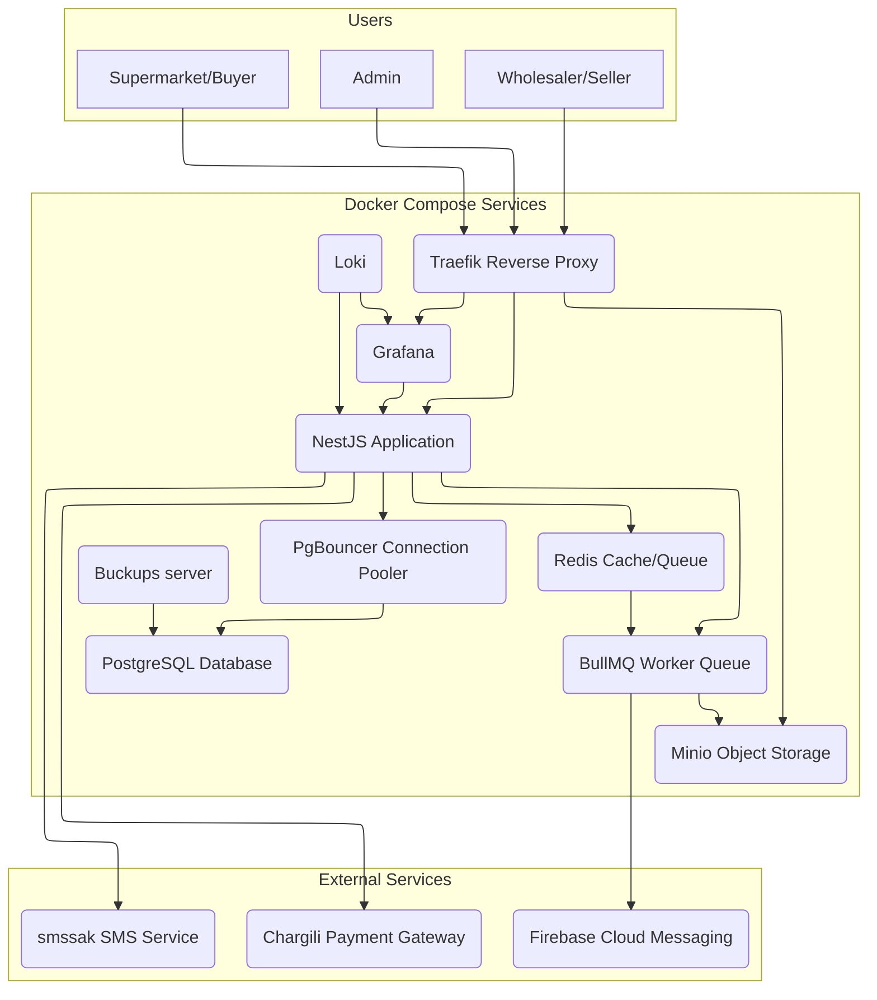

```mermaid
---
config:
  layout: elk
---
graph TD
 subgraph Users["Users"]
        user_supermarket["Supermarket/Buyer"]
        user_wholesaler["Wholesaler/Seller"]
        user_admin["Admin"]
  end
 subgraph subGraph1["Docker Compose Services"]
        traefik_proxy("Traefik Reverse Proxy")
        nestjs_app("NestJS Application")
        pg_bouncer("PgBouncer Connection Pooler")
        postgres_db("PostgreSQL Database")
        redis_cache("Redis Cache/Queue")
        bullmq_queue("BullMQ Worker Queue")
        minio_storage("Minio Object Storage")
        Loki("Loki")
        Grafana("Grafana")
        Buckups("Buckups server")
  end
 subgraph subGraph2["External Services"]
        chargili_payment("Chargili Payment Gateway")
        firebase_messaging("Firebase Cloud Messaging")
        smssak_service("smssak SMS Service")
  end
    user_supermarket --> traefik_proxy
    user_wholesaler --> traefik_proxy
    user_admin --> traefik_proxy
    traefik_proxy --> nestjs_app & minio_storage & Grafana
    nestjs_app --> pg_bouncer & redis_cache & bullmq_queue & chargili_payment & smssak_service
    pg_bouncer --> postgres_db
    Buckups --> postgres_db
    Loki --> Grafana & nestjs_app
    redis_cache --> bullmq_queue
    Grafana --> nestjs_app
    bullmq_queue --> minio_storage & firebase_messaging
```
